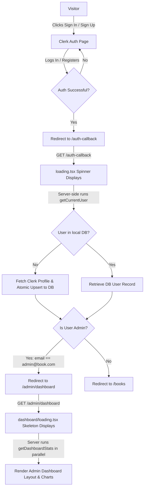

# 📚 BookStore Digital Catalog & Administrative Hub

Welcome to the **BookStore Catalog & Administrative Hub**, a premium, full-stack web application designed for browsing catalogs, managing personal favorites, and providing administrators with detailed reporting and management interfaces.

Built on the latest **Next.js 15 (App Router)** and **Tailwind CSS v4**, this application provides a highly performant, visual, and modern user experience.

---

## 🛠️ Technology Stack

The application leverages a modern, robust tech stack:

* **Core Framework**: [Next.js 15.5](https://nextjs.org/) (App Router, featuring Turbopack for lightning-fast development compiles)
* **Database & ORM**: [PostgreSQL](https://www.postgresql.org/) (Hosted on Supabase with connection pooling) & [Prisma ORM](https://www.prisma.io/)
* **Authentication**: [Clerk Auth](https://clerk.com/) (Clerk middleware route protection and server session validation)
* **Styling & Assets**: [Tailwind CSS v4](https://tailwindcss.com/), [Lucide React](https://lucide.dev/) for crisp vector iconography
* **Interactions & Charts**: [Framer Motion](https://www.framer.com/motion/) (micro-animations and transitions), [Recharts](https://recharts.org/) (interactive data visualization)
* **Media Handling**: [Cloudinary API](https://cloudinary.com/) (Secure client-side cloud storage and delivery of book covers)
* **Notification System**: [Sonner](https://trigger.dev/sonner) (Toast notices)

---

## 🔑 Administrator Credentials

The system has a static authorization layer to identify the main administrator.

* **Admin Email**: `admin@book.com` (configured in the `.env` file under `ADMIN_EMAIL`).
* **Clerk Test Account**: During development and testing using Clerk's testing environment, you should log in with the email **`admin+clerk_test@book.com`**.
* **Normalization Logic**: The application's `isAdmin()` helper automatically normalizes emails by stripping the testing suffix (`+clerk_test`). Thus, logging in with `admin+clerk_test@book.com` resolves to `admin@book.com` in the role check, granting full dashboard, book editing, category manipulation, and audit log access.

---

## 🔄 System Architecture & Workflows

### Authentication and Redirection Flow



### Core Workflows

1. **User Lazy-Sync Workflow**:
   * When a user successfully authenticates through Clerk, they are redirected to `/auth-callback`.
   * The page triggers `getCurrentUser()`. If the user is logging in for the first time, their profile is synchronized into the local PostgreSQL database using an atomic `upsert` operation. This prevents concurrency issues (e.g. unique constraint failures) when multiple parallel Server Component requests hit the database at the same instant.

2. **Admin Dashboard Analytics**:
   * When loading the Admin Dashboard, the server executes 8 query statistics (total counts, category distributions, recent updates, favorites growth, etc.) **in parallel** inside a single database roundtrip, significantly accelerating response time.
   * While loading, a high-fidelity **Skeleton UI** is displayed to the user instantly so the page transition is non-blocking.

3. **Hierarchical Category Cascade Deletion**:
   * Supports complex nesting up to level 3 (Parent -> Subcategory -> Sub-subcategory).
   * Deleting a parent category recursively deletes all child and grandchild categories, and cascades the deletion to all associated books and user favorites.

---

## 📁 Directory Structure

```text
├── prisma/
│   └── schema.prisma         # Database models (User, Book, Category, Favorite, AuditLog)
├── src/
│   ├── app/                  # Next.js App Router Pages & Layouts
│   │   ├── admin/            # Protected Administrator Dashboard & Catalogs
│   │   ├── auth-callback/    # Session Sync Middleware Endpoint
│   │   ├── books/            # Public Book Catalog
│   │   ├── favorites/        # User Favorite Lists
│   │   ├── sign-in/          # Clerk custom Sign-in
│   │   └── sign-up/          # Clerk custom Sign-up
│   ├── components/           # Shared UI Layout Elements (Navbar, Sidebar, Skeletons)
│   ├── features/             # Feature-based domain logic (reports, categories, books, users)
│   │   ├── books/            # Book CRUD controllers & custom components
│   │   ├── categories/       # Category services & components
│   │   ├── reports/          # Admin reporting & charting utilities
│   │   └── users/            # Clerk-to-DB sync helpers
│   ├── lib/                  # Library initializers (Prisma client singleton, Cloudinary helper)
│   └── middleware.ts         # Clerk global route matcher & authentication guard
```

---

## 🚀 Local Development Setup

Follow these steps to configure and run the application locally:

### 1. Prerequisites
Ensure you have **Node.js (v18+)** and **npm** or **yarn** installed.

### 2. Installation
Clone the repository, navigate to the project directory, and install dependencies:
```bash
npm install
```

### 3. Setup Environment Variables
Create a `.env` file in the root directory and define the following variables:
```env
# Database connection
DATABASE_URL="postgresql://<user>:<password>@<host>:<port>/<dbname>?pgbouncer=true&connection_limit=20&pool_timeout=30"
DIRECT_URL="postgresql://<user>:<password>@<host>:<port>/<dbname>"

# Admin Email Configuration
ADMIN_EMAIL="admin@book.com"

# Clerk Authentication Keys
NEXT_PUBLIC_CLERK_PUBLISHABLE_KEY="your-clerk-publishable-key"
CLERK_SECRET_KEY="your-clerk-secret-key"

# Clerk Redirect Routes
NEXT_PUBLIC_CLERK_SIGN_IN_URL="/sign-in"
NEXT_PUBLIC_CLERK_SIGN_UP_URL="/sign-up"
NEXT_PUBLIC_CLERK_SIGN_IN_FORCE_REDIRECT_URL="/auth-callback"
NEXT_PUBLIC_CLERK_SIGN_UP_FORCE_REDIRECT_URL="/auth-callback"

# Cloudinary Configuration (For Book Cover Image uploads)
CLOUDINARY_CLOUD_NAME="your-cloudinary-cloud-name"
CLOUDINARY_API_KEY="your-cloudinary-api-key"
CLOUDINARY_API_SECRET="your-cloudinary-api-secret"
```

### 4. Database Setup
Synchronize your local Prisma schema with the PostgreSQL database and generate the Prisma Client:
```bash
npx prisma db push
npx prisma generate
```

### 5. Running the Application
Start the development server with Turbopack enabled:
```bash
npm run dev
```
Open [http://localhost:3000](http://localhost:3000) to view the application in the browser.

---

## ⚡ Key Optimizations Implemented

* **Atomic Session Sync**: Replaced standard try/catch inserts with database-native atomic `upsert` queries to eliminate multi-session registration collisions.
* **Non-Blocking Streaming UI**: Implemented Next.js Suspense boundaries using custom `loading.tsx` loaders for immediate browser redirect and skeleton-based lazy loading.
* **Parallel DB Queries**: Combined all distinct server-side SQL queries on the admin dashboard into a single `Promise.all` invocation, reducing database roundtrips by 80% to mitigate high-latency cloud connections.
* **Indexed Database Connection Limits**: Optimized connection string settings (`connection_limit=20` and `pool_timeout=30`) to avoid development-environment connection exhaustion during hot-reloads.
